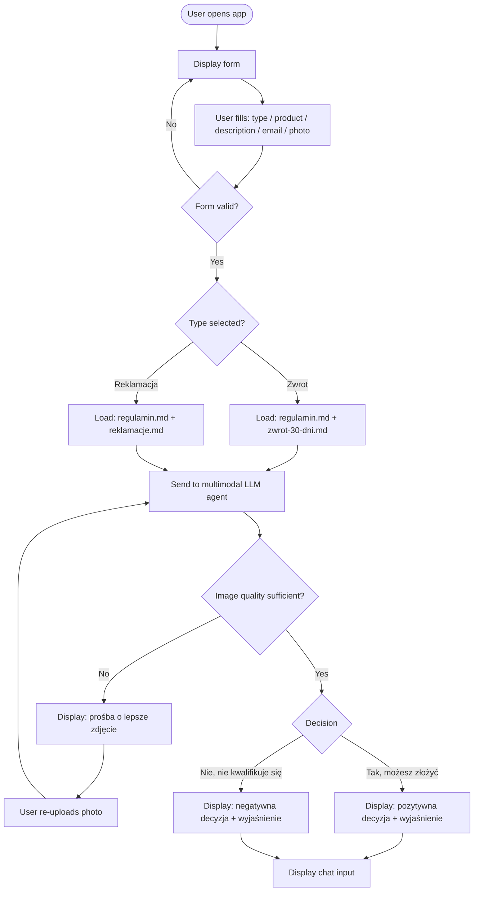
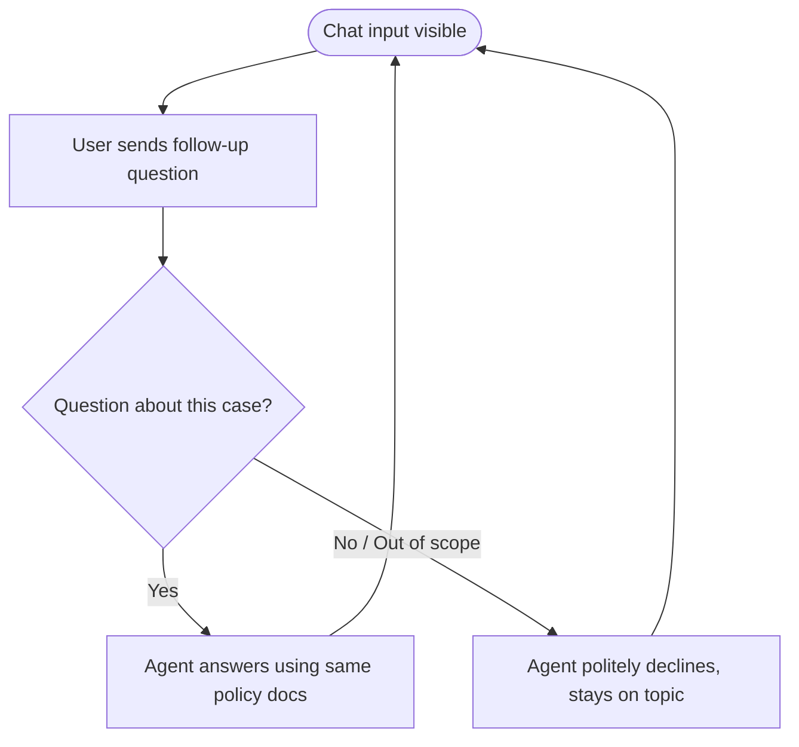

# PRD — Sinsay AI Return & Complaint Advisor (MVP)

---

## 1. Executive Summary

A Polish-language web application that helps Sinsay customers determine whether their product qualifies for a return or complaint. The user submits a form with product details and a photo; an AI agent analyzes the submission against Sinsay's policy documents and provides a decision with explanation. The user can then ask follow-up questions about their specific case in a chat window.

---

## 2. Problem Statement

Sinsay customers are unsure whether their product condition and circumstances qualify for a return or complaint under Sinsay's policy. Contacting customer support for this initial assessment creates unnecessary load on the support team and frustration for users who get rejected after going through the full process. This tool provides an instant, policy-grounded pre-assessment before the user takes any action.

---

## 3. Users / Personas

**Persona 1 — Kasia, 24, online shopper**
Bought a blouse that arrived with a seam defect. She doesn't know if this qualifies as a complaint or just a return. She wants a quick answer before calling the hotline.

**Persona 2 — Marek, 35, occasional online buyer**
Ordered shoes, wore them once, and they fell apart. He's unsure if this counts as a complaint and whether the wear disqualifies him. He needs a clear explanation grounded in the policy.

**Persona 3 — Anna, 42, returning customer**
Bought a jacket, doesn't like the fit, and wants to return it. She's unsure about the 30-day window and whether the lack of original packaging is a problem. She wants to know exactly what to do next.

---

## 4. Main Flow

### Scenario A — Successful return assessment

1. User opens the application and sees a form.
2. User selects **"Zwrot"** (return) from a dropdown.
3. User enters product name (text field).
4. User enters problem description (text area).
5. User enters email address (email field, for reference display only — no email is sent).
6. User uploads a photo of the product.
7. User submits the form.
8. Application sends the form data + photo + `docs/regulamin.md` + `docs/zwrot-30-dni.md` to the multimodal LLM agent.
9. Agent analyzes whether the product's condition (from the photo) and the described circumstances are consistent with Sinsay's return policy.
10. Application displays the agent's decision and explanation in Polish.
11. A chat input field appears below the decision. The user can ask follow-up questions.
12. Agent answers only questions related to this specific case, using the same attached policy documents as context.

### Scenario B — Successful complaint assessment

Same as Scenario A, except:
- User selects **"Reklamacja"** (complaint).
- Application attaches `docs/regulamin.md` + `docs/reklamacje.md` to the agent (not `zwrot-30-dni.md`).
- Agent evaluates whether the described defect and product condition qualify for a complaint under Sinsay's policy.

### Scenario C — Poor image quality

1–7. Same as Scenario A or B.
8. Agent determines the photo is too low quality or unclear to assess the product condition.
9. Application displays a message asking the user to upload a clearer photo.
10. User re-uploads the photo.
11. Flow continues from step 8 of Scenario A.

### Scenario D — Negative decision

1–9. Same as Scenario A or B.
10. Agent determines the product does not qualify (e.g., visible user damage beyond normal wear, return window exceeded, product ometkowanie missing).
11. Application displays the rejection decision with a clear policy-based explanation.
12. Chat window appears. User can ask follow-up questions about the decision.

---

## 5. User Stories

1. As a customer, I want to select whether I am making a return or a complaint, so that the agent uses the correct policy document for my case.
2. As a customer, I want to describe my problem in a text field, so that the agent has context beyond what the photo shows.
3. As a customer, I want to upload a photo of the product, so that the agent can visually assess its condition.
4. As a customer, I want to receive a clear decision in Polish (yes/no I can proceed), so that I know whether to initiate the formal process with Sinsay.
5. As a customer, I want to receive a policy-based explanation for the decision, so that I understand why I can or cannot proceed.
6. As a customer, I want to ask follow-up questions after the decision, so that I can clarify details about my specific case.
7. As a customer, I want to be asked to re-upload my photo if it is unclear, so that the assessment is based on adequate visual information.
8. As a customer, I want the entire experience in Polish, so that I can use it without language barriers.
9. As a customer, I want the form to be the only thing I see on load, so that the interface is simple and focused.
10. As a customer who selected "complaint", I do not want return-specific policy information shown, so that the guidance is relevant and not confusing.

---

## 6. Acceptance Criteria

**Form**
- [ ] Form displays exactly 5 fields: type selector (zwrot/reklamacja), product name, problem description, email address, image upload.
- [ ] Form cannot be submitted unless all 5 fields are filled and an image is attached.
- [ ] Email field validates format (must contain `@`).
- [ ] Image field accepts JPG, PNG, WEBP. Max file size: 10 MB.

**Document routing**
- [ ] When type = "Zwrot": agent receives `docs/regulamin.md` + `docs/zwrot-30-dni.md` and only these two files.
- [ ] When type = "Reklamacja": agent receives `docs/regulamin.md` + `docs/reklamacje.md` and only these two files.

**Agent decision**
- [ ] Agent response is always in Polish.
- [ ] Agent response contains a clear yes/no determination followed by an explanation grounded in the policy.
- [ ] If the image is too unclear to assess, agent response asks the user to upload a better photo instead of giving a yes/no decision.
- [ ] After re-upload, agent re-evaluates and provides a decision.

**Chat window**
- [ ] Chat input appears only after the initial decision is displayed.
- [ ] Agent in chat mode uses the same policy documents as context (no additional documents added).
- [ ] Agent in chat mode answers only questions about the user's specific case; it does not answer unrelated general queries (e.g., shipping times, pricing).

**UI / Language**
- [ ] All UI text is in Polish.
- [ ] No email is sent at any point.
- [ ] No data is persisted after the session ends.

---

## 7. Out of Scope

- Submitting or initiating an actual return or complaint with Sinsay (no integration with Sinsay systems).
- Sending confirmation or summary emails to the user.
- User accounts, login, or session persistence.
- Order number lookup or validation.
- Support for any language other than Polish.
- Answering general questions about Sinsay (shipping, payments, store locations, etc.).
- Mobile app — web only.
- Admin dashboard, analytics, or logging.
- Multi-image upload (one image per submission).

---

## 8. Technical and Business Constraints

- The application must use a **multimodal LLM** capable of analyzing both text and images in a single request.
- Policy documents are loaded from local files at request time (not embedded in the system prompt at build time), so that updating the markdown files updates the agent's knowledge without redeployment.
  - `docs/regulamin.md` — Sinsay Terms of Service (always included)
  - `docs/reklamacje.md` — Complaint process (included for "Reklamacja" flow only)
  - `docs/zwrot-30-dni.md` — Return process (included for "Zwrot" flow only)
- The agent must not fabricate policy details. All decisions must be grounded exclusively in the attached documents.
- No backend database. Session state lives in memory for the duration of the conversation only.
- The application is a proof-of-concept / MVP. No SLA, no uptime requirements, no load testing requirements at this stage.

---

## 9. User Flow Diagrams

### Form submission and decision flow

### Chat follow-up flow

